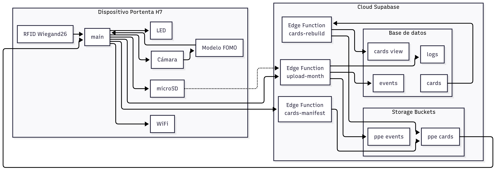
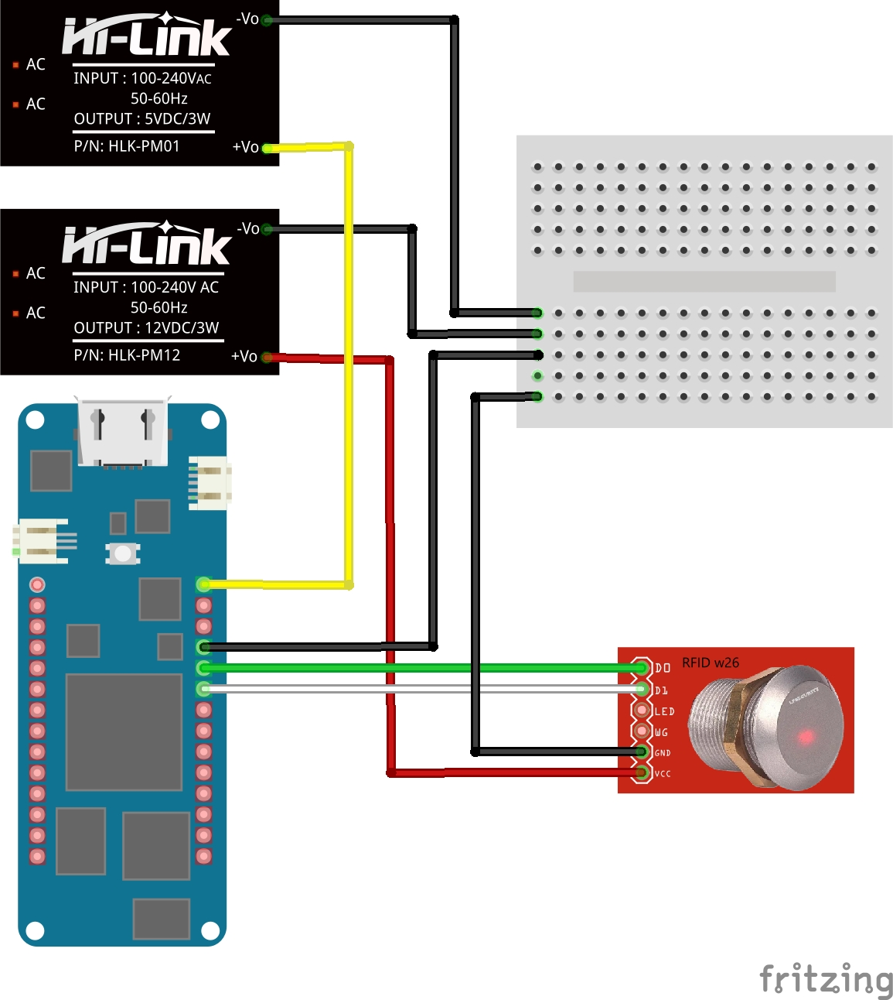

# Reconocimiento en tiempo real de equipos de protección individual mediante Tiny Machine Learning en dispositivos Internet of Things

Este proyecto corresponde al Trabajo de Fin de Grado en la Universitat Politècnica de València.  
El objetivo es implementar un sistema autónomo de control de accesos que verifique en tiempo real si un operario lleva el casco de seguridad antes de entrar en zonas de riesgo.

El prototipo se ha desarrollado sobre una placa Arduino Portenta H7 con Vision Shield y un lector RFID Wiegand-26. El sistema combina la identificación mediante tarjeta con visión artificial y modelos TinyML entrenados en Edge Impulse. Los datos locales se almacenan en la tarjeta microSD y se sincronizan con una base de datos en Supabase.

---

## Funcionamiento del sistema

1. El operario pasa su tarjeta por el lector RFID.  
2. La Portenta captura una imagen con la cámara integrada.  
3. El modelo FOMO determina si el trabajador lleva casco.  
4. El sistema activa un LED de señalización según el resultado.  
5. El evento se guarda en un archivo local y se envía a Supabase para su registro.

---

## Arquitectura general

  

El sistema se organiza en dos bloques principales:

- **Dispositivo Portenta H7**: gestiona el lector RFID, la cámara, la inferencia del modelo, el almacenamiento en microSD y la comunicación WiFi.
- **Cloud Supabase**: aloja la base de datos de tarjetas y eventos, los buckets de almacenamiento y las funciones Edge para sincronización.

---

## Esquema de conexiones

  

El montaje incluye:

- Fuentes de alimentación (FA) de 5 y 12 V.
- Portenta H7 alimentada con la FA de 5 V.  
- Lector RFID Wiegand-26 conectado a la Portenta para la identificación de tarjetas y a la FA de 12 V.  
- MicroSD para almacenamiento local de los registros.

