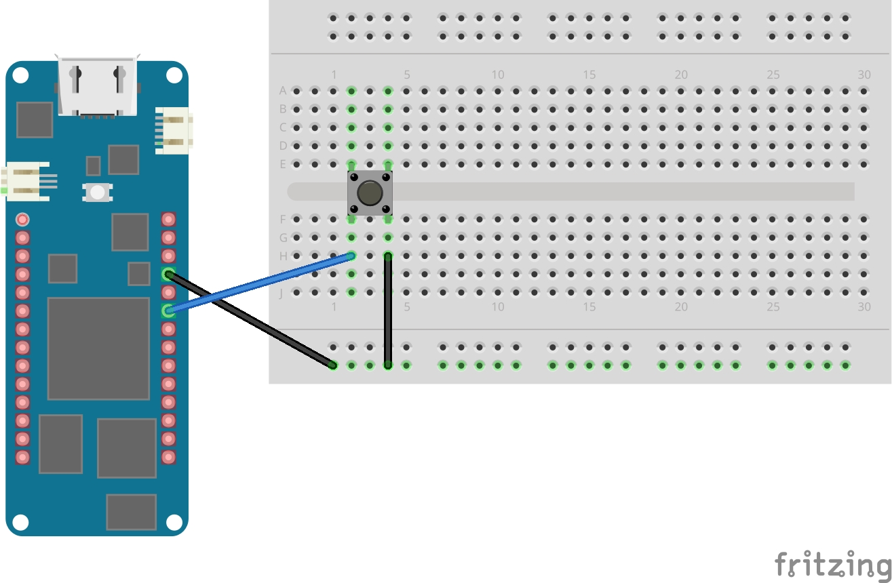

# Captura de Imágenes con Portenta H7

Este módulo corresponde a la **primera parte de mi Trabajo de Fin de Grado (TFG)**.  
Su objetivo ha sido facilitar la **toma de imágenes para crear el dataset** que más adelante se utilizará en el entrenamiento del modelo de detección de EPIs (casco / nocasco).

Para ello, se ha implementado un sistema sencillo en la **Portenta H7** que, mediante un botón físico, permite capturar imágenes de forma controlada y rápida, asegurando que el dataset contenga muestras bien etiquetadas y de calidad.

---

## Conexión del botón

El siguiente esquema muestra cómo conectar el botón a la Portenta:

- **D14**: Pin de señal del botón.
- **GND**: Tierra común.

---

## Uso

1. Conecta el botón según el esquema.
2. Carga el código `capturaimagenconboton.py` en la Portenta.
3. Presiona el botón para capturar una imagen.
4. Las imágenes se guardarán en la carpeta configurada en el código.

---

## Archivos relevantes

- `capturaimagenconboton.py` → Código para captura con botón.
- `conexion_capturaconboton_bb.jpg` → Esquema de conexión.
